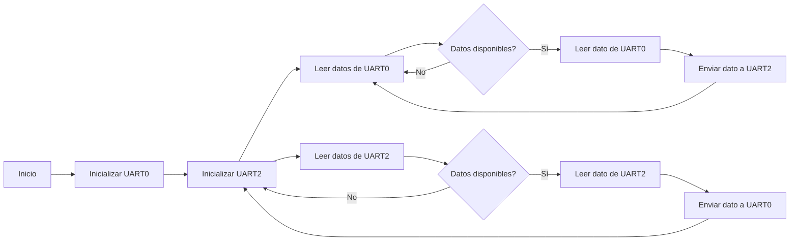
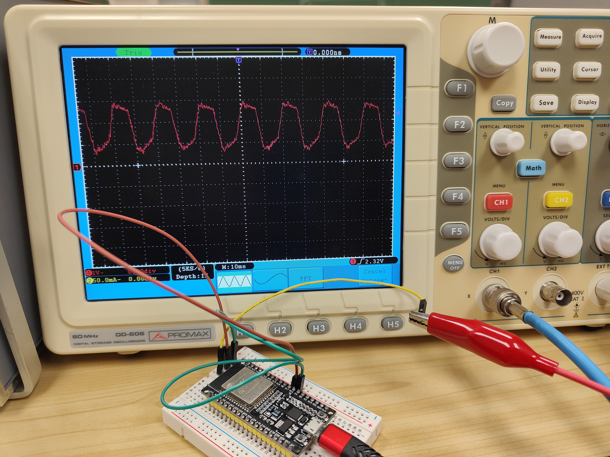

## **PRÁCTICA UART**

Alumna: **Àfrica Abad**


*UART* (Universal Asynchronous Receiver/Transmitter): define un protocolo o un conjunto de normas para el intercambio de datos en serie entre dos dispositivos. UART  utiliza solo dos hilos entre el transmisor y el receptor para transmitir(Tx) y recibir(Rx) en ambas direcciones. 


Una de las mayores ventajas de UART es que es asíncrono: el transmisor y el receptor no comparten la misma señal de reloj. Puesto que no comparten un reloj, ambos extremos deben transmitir a la misma velocidad, previamente concertada, con el fin de mantener la misma temporización de los bits.


Las tramas UART contienen bits de inicio y de parada, bits de datos y un bit opcional de paridad.

----


## Explicación del código

En esta práctica hemos hecho un programa que establece comunicación bidireccional entre dos puertos seriales (UART), en nuestro caso entre el monitor y el teclado.

1. Inicialización en el `setup()`:

- Se inicializa la comunicación serial para el puerto UART0 a una velocidad de 115200 baudios.

        ```cpp
        Serial.begin(115200);
        ```
- Se inicializa la comunicación serial para el puerto UART2  también a una velocidad de 115200 baudios, utilizando 8 bits de datos, sin paridad y 1 bit de parada (configuración `SERIAL_8N1`). Se especifican los pines físicos en los que se conectará esta comunicación serial, en este caso, GPIO17 (TX2) y GPIO16 (RX2).

        ```cpp
        Serial2.begin(115200, SERIAL_8N1, 17, 16);
        ```

2. `loop()`:

En el bucle principal, el programa está constantemente revisando si hay datos disponibles en UART0 (`Serial.available()`). Si hay datos disponibles, se lee un carácter de UART0 utilizando `Serial.read()` y se envía ese carácter a UART2 utilizando `Serial2.write(c)`.

Después  el programa verifica si hay datos disponibles en UART2 (`Serial2.available()`). Si hay datos disponibles, se lee un carácter de UART2 usando `Serial2.read()` y se envía ese carácter de vuelta a UART0 utilizando `Serial.write(c)`.


### Diagrama de flujo 


### Resultado osciloscopio




Cuando enviamos datos desde el teclado a través de UART0 y los muestreamos en el osciloscopio, lo que vemos depende de la forma en que el osciloscopio interprete los datos introducidos.
